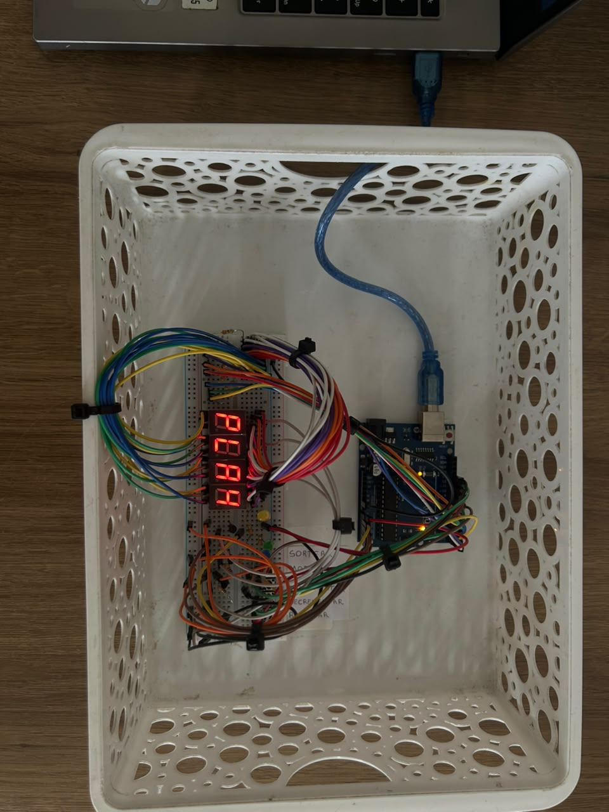
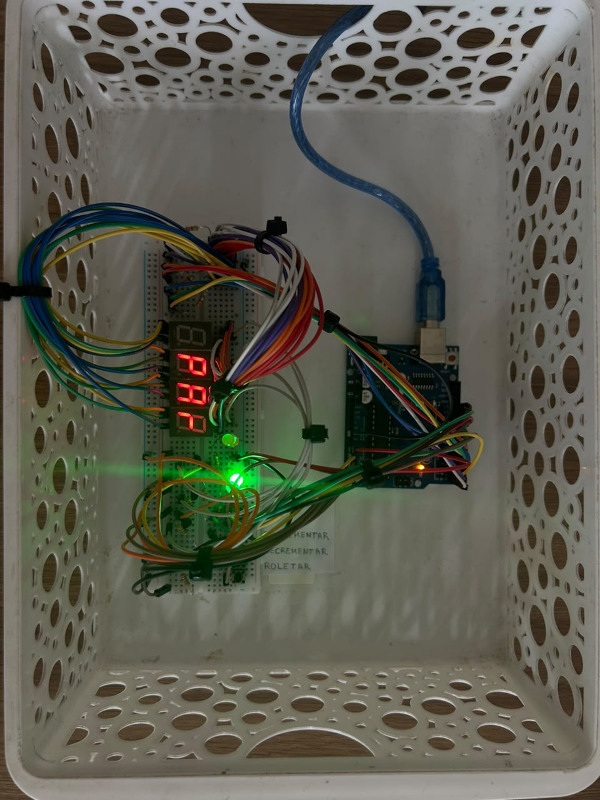
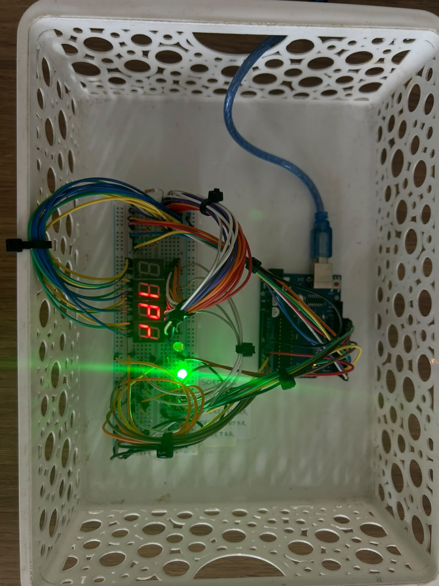
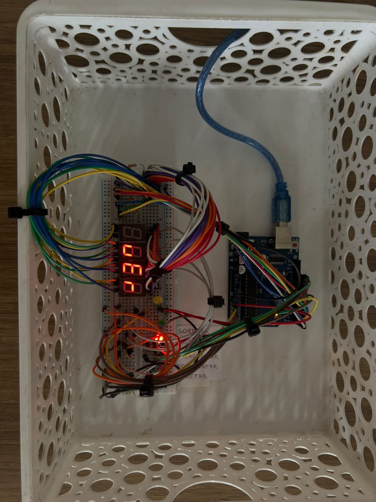
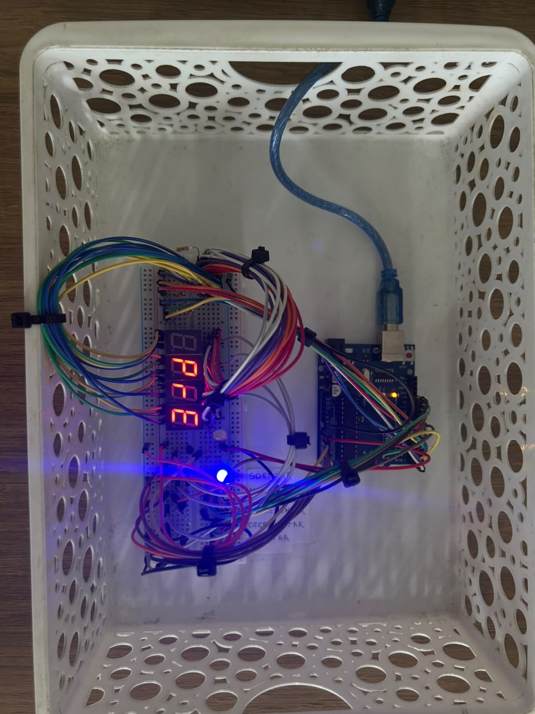
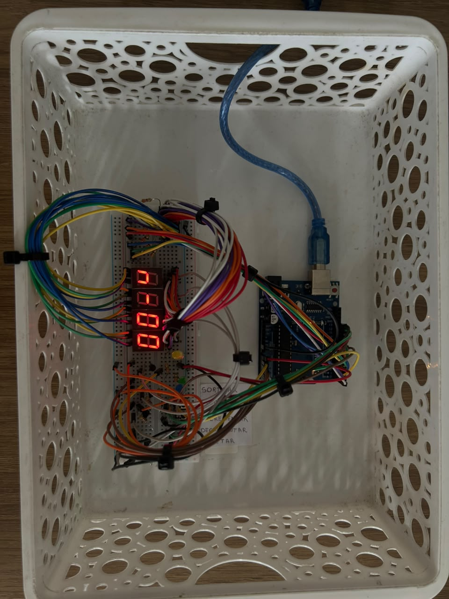
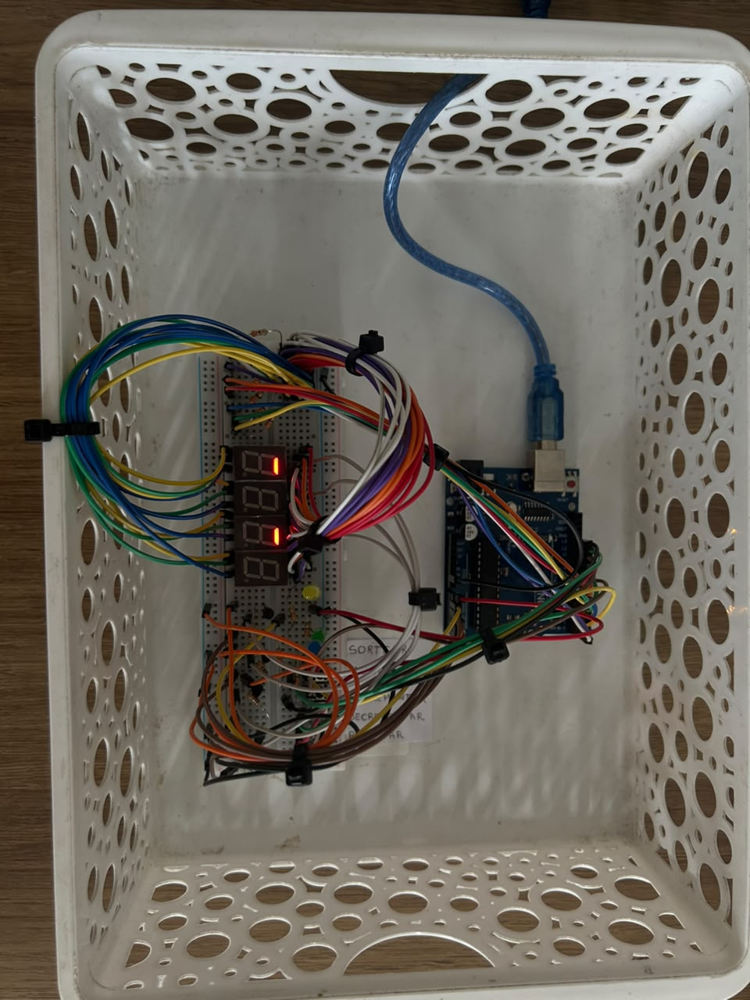
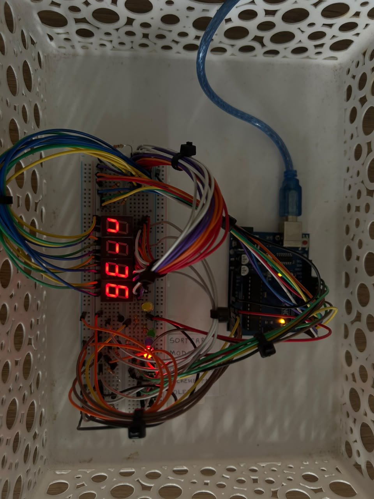
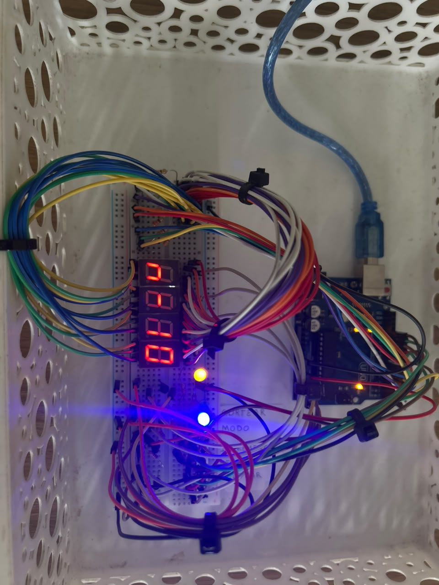
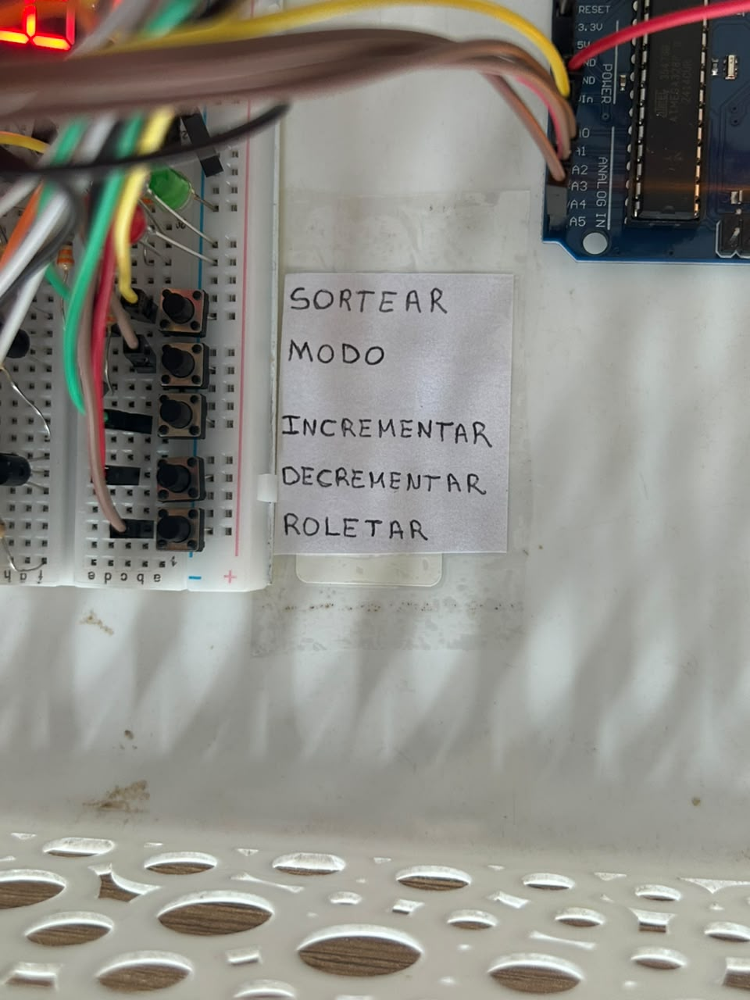

## 3.3. Fotos do circuito físico 

3.3.1.Tela inicial (*Play*):

3.3.2. Modo Par:

3.3.3. Modo Ímpar:

3.3.4 Modo Vermelho:

3.3.5 Modo Preto:

3.3.6 Modo Número Específico:

3.3.7 Frame animação de sorteio:

3.3.8 Exemplo de fracasso:

3.3.9 Exemplo de vitória:

3.3.10 Botões físicos:
