## 3.2. Prints do diagrama no SimulIDE

## 3.2.1. Prints do Circuito Completo:

3.2.1.1 Circuito Desligado:

3.2.1.2 Circuito modo Play:
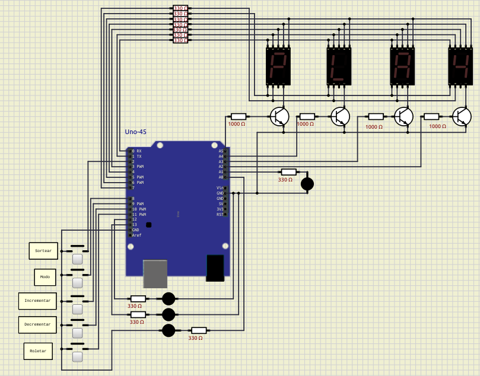

3.2.1.3 Circuito modo Par:

3.2.1.4 Circuito modo Ímpar:
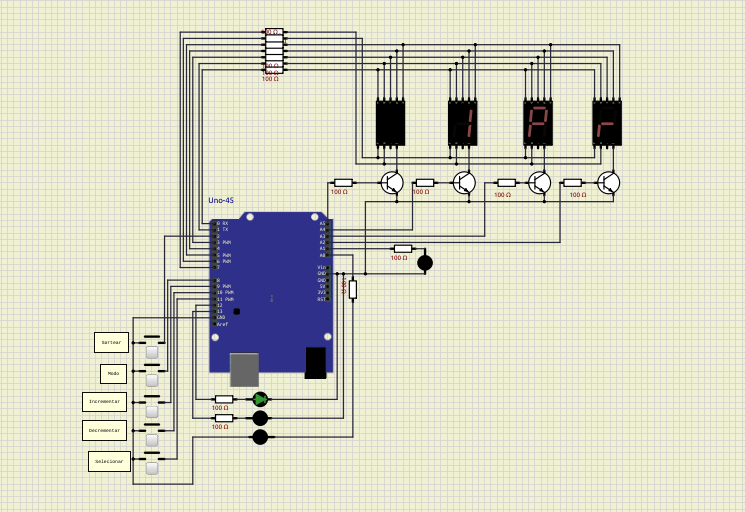

3.2.1.5 Circuito modo Vermelho:
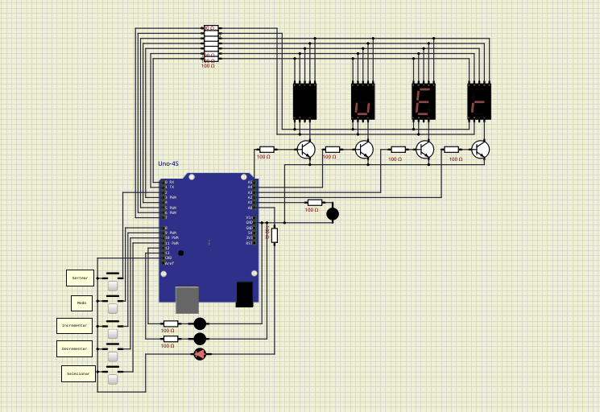

3.2.1.6 Circuito modo Preto:
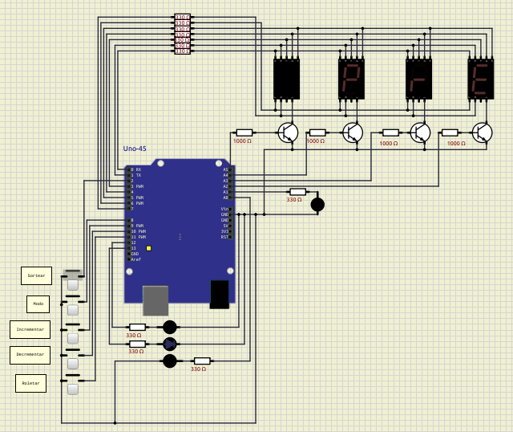

3.2.1.7 Circuito modo Número Específico:

## 3.2.2. Prints do Display

3.2.2.1 Display modo Par:
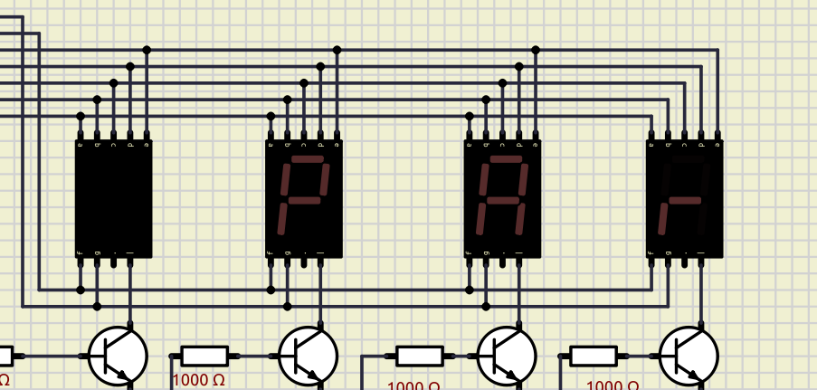

3.2.2.2 Display modo Ímpar:
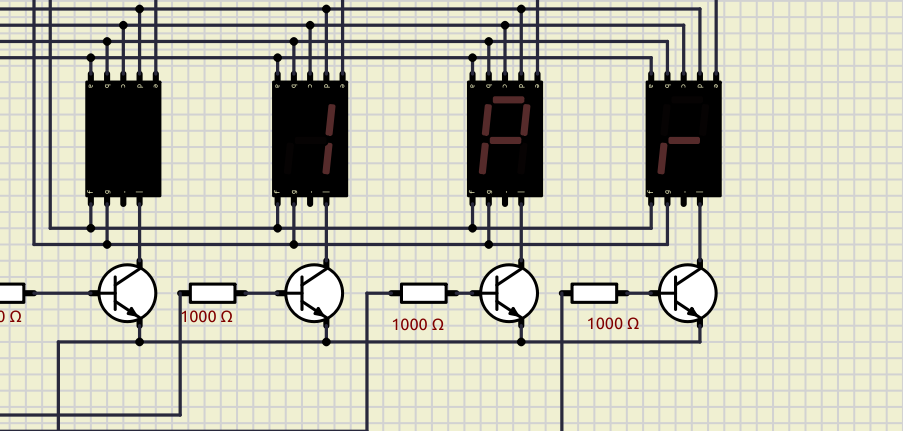

3.2.2.3 Display modo Vermelho:
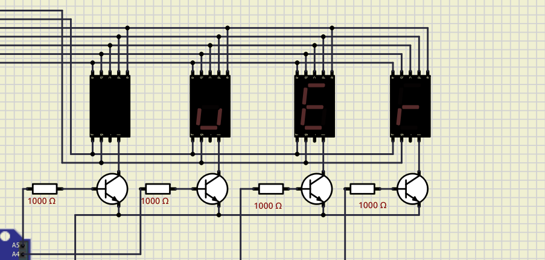

3.2.2.4 Display modo Preto:
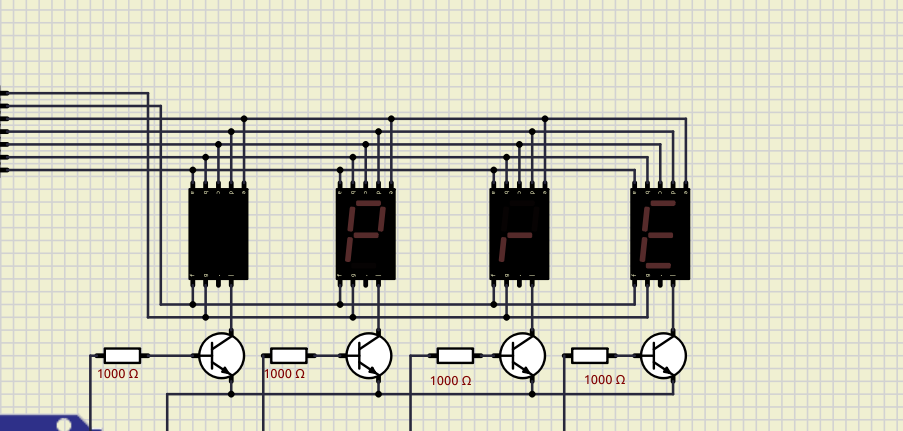

3.2.2.5 Display modo Número Específico:
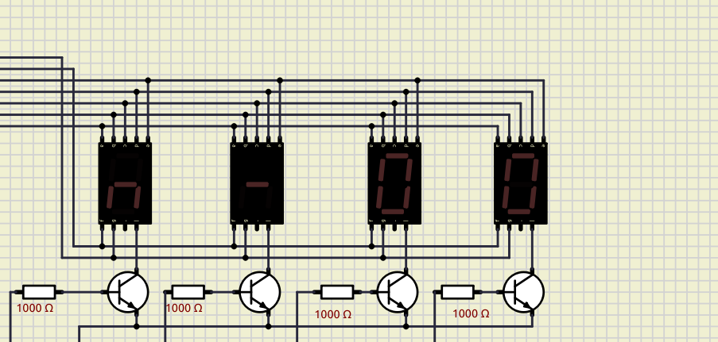

## 3.2.3. Prints dos Leds

3.2.3.1 Leds das Cores desligados:
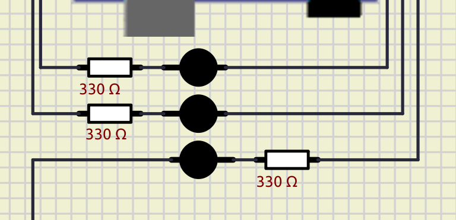

3.2.3.2 Led Verde ligado:
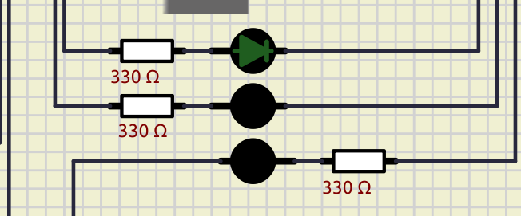

3.2.3.3 Led Azul ligado:
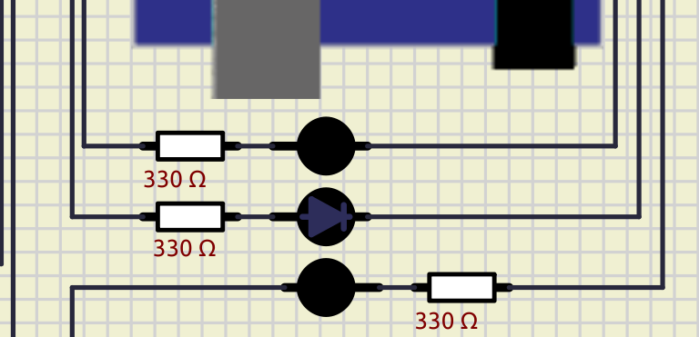

3.2.3.4 Led Vermelho ligado:
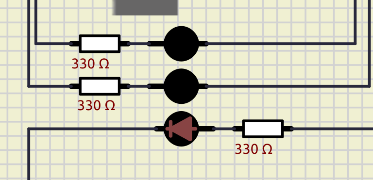

3.2.3.5 Led Vitória desligado:

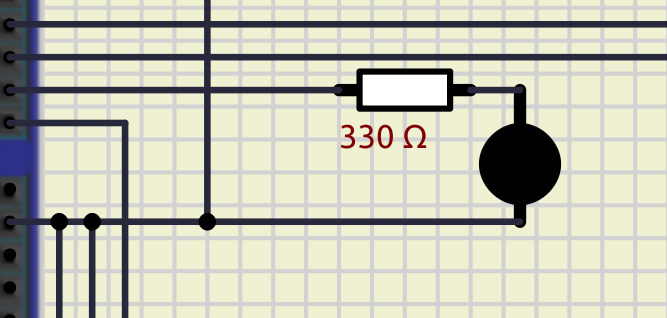

3.2.3.6 Led Vitória ligado:

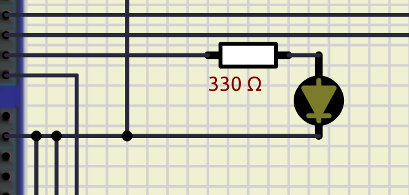

## 3.2.4. Print do Arduíno Uno

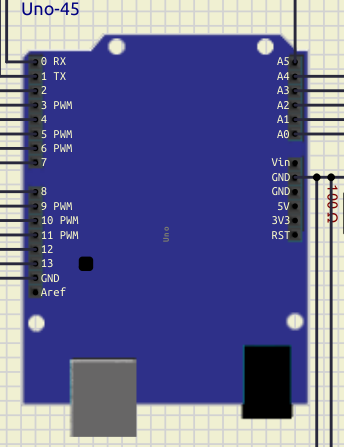

